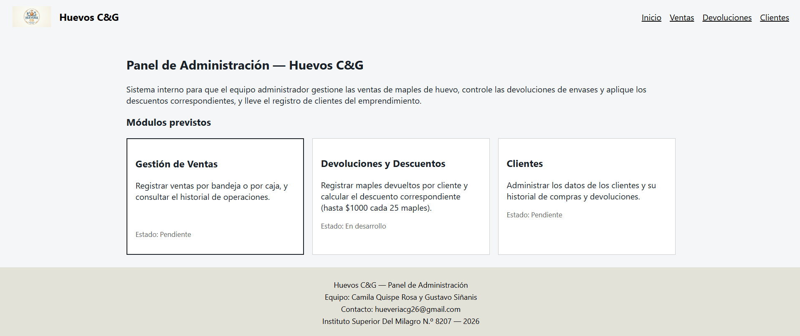

# Huevos C&G — Panel de Administración

Panel interno para gestionar las ventas de maples de huevo, las devoluciones
de envases y los descuentos asociados, y el registro de clientes del
emprendimiento Huevos C&G.

## Integrantes

- Camila Quispe Rosa
- Gustavo Exequiel Siñanis

## Cómo levantarlo

Clonar el repositorio e instalar las dependencias:

==================================================
git clone https://github.com/QuispeCamila/Hueveria-CG.git
cd Hueveria-CG
npm install
npm run dev
==================================================

Luego abrir en el navegador la URL que indica la terminal (por defecto
`http://localhost:5173`).

## Captura

